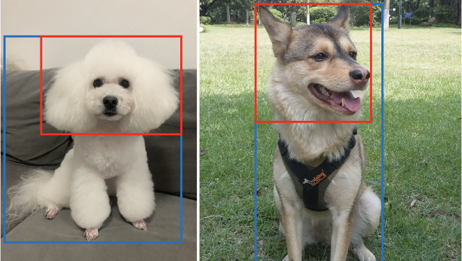

# Tsinghua-Dogs
<div align="center">
 
 Fig. 1 Variation in Tsinghua Dogs dataset. (a) Great Danes exhibit large variations in appearance, while (b) Norwich terriers and (c) Australian terriers are quite similar to each other.
</div>

<br />

Tsinghua Dogs is a fine-grained classification dataset for dogs, over 65% of whose images are collected from people's real life. Each dog breed in the dataset contains at least 200 images and a maximum of 7,449 images, basically in proportion to their frequency of occurrence in China, so it significantly increases the diversity for each breed over existing dataset (see Fig. 1). 

Details about Tsinghua Dogs can be found in this [paper](https://doi.org/10.1007/s41095-020-0184-6). 

## Anotation

<div align="center">
 
 <br />
 Fig. 2 Annoations: bounding boxes for whole dogs (<font color="blue">blue</font>) and their heads (<font color="red">red</font>).
</div>

<br />
Tsinghua Dogs annotated bounding boxes of the dog’s whole body and head in each image (see Fig. 2), which can be used for supervising the training of learning algorithms as well as testing them. The annoation is stored in `xml` file with a root tag `annotation`

## Statistics

* Number of categories: 130;
* Total number of images: 70428;
* Number of training: 65228;
* Number of validation: 5200.

## Download

The dataset provides two versions of images to download: high resolution and low resolution.

* Low resolution
  * Images (2.5 GB): [low-resolution](https://cloud.tsinghua.edu.cn/f/80013ef29c5f42728fc8/?dl=1)
  * Annotations: [low-annotations](https://cg.cs.tsinghua.edu.cn/ThuDogs/low-annotations.zip)
* High resolution
  * Images (38.8GB): [high-resolution.001](https://cloud.tsinghua.edu.cn/f/d2031efb239c4dde9c6c/?dl=1),[high-resolution.002](https://cloud.tsinghua.edu.cn/f/6a242a6bba664537ba45/?dl=1),[high-resolution.003](https://cloud.tsinghua.edu.cn/f/d17034fa14f54e4381d8/?dl=1),[high-resolution.004](https://cloud.tsinghua.edu.cn/f/3740fc44cd484e1cb089/?dl=1),[high-resolution.005](https://cloud.tsinghua.edu.cn/f/ff5d96a0bc4e4dba9004/?dl=1),[high-resolution.006](https://cloud.tsinghua.edu.cn/f/d5fe5c88198c4387a7bb/?dl=1),[high-resolution.007](https://cloud.tsinghua.edu.cn/f/b13d6710ac85487e9487/?dl=1),[high-resolution.008](https://cloud.tsinghua.edu.cn/f/b6cf354fd04b4fe0b909/?dl=1),[high-resolution.009](https://cloud.tsinghua.edu.cn/f/06a421a528044b15838c/?dl=1)
  * Annotations: [high-annotations](https://cg.cs.tsinghua.edu.cn/ThuDogs/high-annotations.zip)
* Train and validation split:

## Benchmarking

### Fine-grained classification
We have benchmarked several classification methods on our dataset, including both general neural networks and fine-grained models which exhibit good performance on other fine-grained datasets.

| Rank | Model | Backbone | Batchsize | Epochs | Accuracy (%) | Year | 
|:--------------:|:--------------:|:--------------:|:--------------:|:--------------:|:--------------:|:--------------:|
| 1 | [WS_DAN](https://github.com/wvinzh/WS_DAN_PyTorch) | Inception v3 | 12 | 80 | 86.4 | 2019 |
| 2 | [TBMSL-Net](https://github.com/ZF1044404254/TBMSL-Net) | Resnet50  | 6 | 200 | 83.7 | 2020 |
| 3 | [PMG](https://github.com/RuoyiDu/PMG-Progressive-Multi-Granularity-Training) | Resnet50 | 16 | 200 | 83.5 | 2020 |
| 4 | [Inception v3](https://pytorch.org/hub/pytorch_vision_inception_v3) | Inception v3 | 64 | 200 | 77.7 | 2016 |

## Useful links

* Project home page: https://cg.cs.tsinghua.edu.cn/ThuDogs/.
* Research home page: https://cg.cs.tsinghua.edu.cn.

## Citing

Please cite our Tsinghua Dogs in your publications if it helps your research:
```BibTeX
@article{Zou2020ThuDogs,
  title={A new dataset of dog breed images and a benchmark for fine-grained classification},
  author={Zou, Ding-Nan and Zhang, Song-Hai and Mu, Tai-Jiang and Zhang, Min},
  booktitle={Computational Visual Media},
  year={2020},
  url={https://doi.org/10.1007/s41095-020-0184-6}
} 
```
